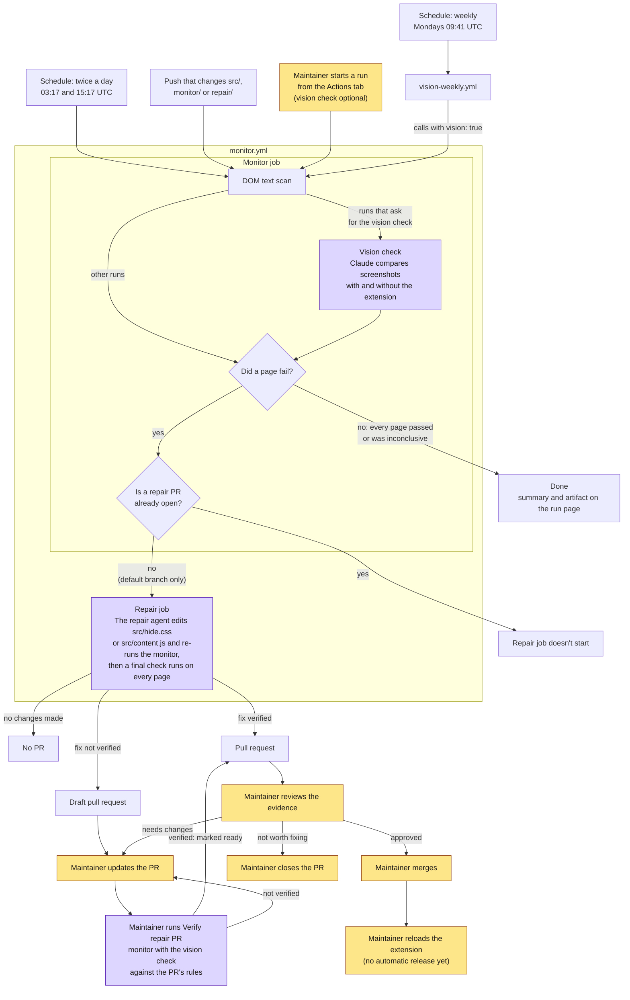

# Workflow

How the extension is kept working as YouTube changes: what runs, who decides what, and where people come in. [DESIGN.md](DESIGN.md) covers how each part works and how to run it; this document covers the process and the reasoning behind it.

It's organized around the people the process serves, following goal-directed task analysis: start from each person's goals, list the decisions they have to make, and work out what information each decision needs. The automation exists to supply that information and do the routine work, not the other way round. Sections marked **(planned)** describe parts that aren't built yet.

## Who it's for

| Person | Goal | What failure looks like to them |
|---|---|---|
| **Viewer** (uses the extension) | Watch YouTube without engagement numbers influencing what they watch | A view or like count appears (missed stat), or something they need disappears, such as a title, date or button (false positive) |
| **Maintainer** (owns this repo) | Keep the extension working with little time spent, and never ship a change they don't trust | Finding out about a breakage from a viewer, spending hours diagnosing a layout change, or merging a rule that hides the wrong thing |
| **Maintainer as experimenter** (this is an exploratory project) | Learn how well AI agents can keep the extension working on their own | Not knowing whether the agents are doing well: how many stats they catch, how often they hide the wrong thing, how often repairs work and what they cost |

Three principles follow from these goals:

1. **Automate detection, fixing and checking; the maintainer approves.** Machines watch YouTube around the clock, draft fixes and check them. The DOM text scan and the vision check judge whether a change hides every stat and only stats; that judgment is the automation's job, not the maintainer's. The maintainer approves what ships, based on that evidence, and steps in where the automation falls short. The aim is checks trustworthy enough that approving is quick.
2. **A false positive is worse than a missed stat.** A missed stat is the problem the extension exists to solve, so it's expected now and then. Hiding a title or a button breaks YouTube itself for the viewer. Every check, automated or human, should treat anything that hides more than a number with extra suspicion.
3. **Measure everything.** Recall (stats hidden), false positives (wrong things hidden), repair success rate and cost per repair show whether the approach works. They matter as much as the fixes themselves.

## Who does what

Each step is done by one of these actors:

| Actor | Kind | Role |
|---|---|---|
| GitHub Actions scheduler | Automation | Starts runs on a schedule, on pushes and on request |
| Monitor (DOM text scan, page loading, bot-check detection) | Automation, deterministic code | Detects breakages. Same input, same result |
| Vision check | AI agent (Claude) | Judges screenshots: are any stats still visible, and is anything hidden that should stay visible? |
| Repair agent | AI agent (Claude) | Diagnoses breakages and drafts fixes. Its work is checked by the monitor, including the vision check, before the maintainer sees it |
| Maintainer | Human, often working with an AI coding agent | Approves fixes, updates them when they need changes, decides scope, handles what the automation can't |

## The workflow

Yellow steps are done by a person (updating a PR, usually with an AI coding agent's help) and purple steps by an AI agent; the rest is automation.

## Step by step

### 1. A run starts

| | |
|---|---|
| **Actor** | Scheduler, or the maintainer |
| **Triggers** | Twice a day (DOM text scan only); weekly through `vision-weekly.yml` (adds the vision check); pushes to `src/`, `monitor/` or `repair/`; manual runs, with an optional **Run the vision check** box |
| **Why this split** | The DOM text scan is free, so it runs often to catch breakages within about 12 hours. The vision check costs API tokens, so it runs weekly or when a person asks for it |
| **What can go wrong** | GitHub can delay scheduled runs, and turns schedules off in public repos after 60 days without activity |

### 2. The monitor job checks each page

| | |
|---|---|
| **Actor** | Automation (DOM text scan) and AI agent (vision check, when on) |
| **Does** | Loads each target page (a watch page, search, a hashtag page, a channel's videos) with and without the extension. Scans the visible text for stats, and on vision runs asks Claude to compare screenshots for missed stats and wrongly hidden content. A failing page gets a second attempt before the failure counts |
| **Produces** | A pass, fail or inconclusive result per page; a summary on the run page; an artifact with screenshots and DOM snapshots (kept 30 days) |
| **What can go wrong** | YouTube shows a bot check or consent page (reported as inconclusive, not a failure); the DOM scan's patterns miss a new format; the vision check misreads a screenshot (false alarm or missed stat) |

What counts as a stat to hide, and what must stay visible, is defined in [monitor/scope.mjs](monitor/scope.mjs). Both the vision check and the repair agent read it.

### 3. The open-PR check

| | |
|---|---|
| **Actor** | Automation, inside the monitor job |
| **Does** | When a page failed, checks for an open PR labeled `auto-repair` |
| **Why** | One repair PR at a time. While a fix is waiting for review, later failures are almost always the same breakage, and running the agent again would only spend money and open a duplicate |
| **What can go wrong** | A *different* breakage that happens while a repair PR is open isn't repaired until that PR is merged or closed (see [Gaps](#gaps-found-by-this-analysis)) |

### 4. The repair job drafts a fix

| | |
|---|---|
| **Actor** | AI agent (Claude), boxed in by automation |
| **Does** | Reads the failed run's DOM snapshots and screenshots, edits `src/hide.css` or `src/content.js`, and re-runs the monitor on the affected pages until they pass or it hits a limit: 20 turns, 4 monitor runs or about $3 (see [Control spend](#control-spend)) |
| **Then** | A final monitor run on every page, done by the workflow rather than trusted from the agent, decides whether the fix is verified. Repairs always use the vision check, and a fix is verified only if it passes on every page, so nothing that should stay visible was hidden |
| **Constraints** | The agent works only through its own tools: it can't run commands, reach the network, use git or see any credentials, and can edit only those two files. YouTube pages contain text written by strangers, so the agent is told to treat it as data, and a person reviews everything it writes |

### 5. A pull request is opened

| | |
|---|---|
| **Actor** | Automation (`repair/open-pr.mjs`) |
| **Does** | Commits the agent's change to a new branch and opens a PR labeled `auto-repair`: ready for review if verified; if not, a draft marked `[Unverified]` whose description lists the steps to finish it. No changes means no PR |
| **The PR contains** | The agent's explanation (what broke, what changed, verification, notes for the reviewer), before-and-after screenshots, the final monitor results and the estimated cost |

### 6. The maintainer reviews, refines and merges

| | |
|---|---|
| **Actor** | Human, often with an AI coding agent |
| **Decision** | Does the evidence (the final monitor run, including the vision check) show that the fix hides every stat and only stats? Is any change to `src/content.js` safe to run in viewers' browsers? |
| **Then** | One of: merge; close with a comment; or update the PR, usually with an AI coding agent, then run the **Verify repair PR** workflow on it. If a check only errored and the fix itself is fine, run **Verify repair PR** without updating anything. If every page passes, including the vision check, a draft is marked ready for review. Merging or closing allows the next repair to run |

### 7. The fix reaches viewers

| | |
|---|---|
| **Actor** | Human, today |
| **Does** | Nothing automatic yet. The hiding rules are bundled with the extension, so a merged fix reaches a viewer only when they reload the extension from source |
| **(planned)** | Rules fetched from the project (for example from GitHub Pages), so a merged fix reaches every viewer without a new release |

## Where people come in

Each of these is a moment where a person has to understand something and decide. For each, the table lists what they need to know and where it comes from today.

### Notice that something is wrong

- **Goal:** know about a breakage before viewers do.
- **Decision:** is this a real breakage, a flaky run or YouTube blocking the runner?
- **Information needed:** which pages failed, what was visible, whether it repeated.
- **Today:** GitHub emails the maintainer when a run fails. Failed scheduled runs notify whoever last changed the workflow's schedule; failed push runs notify the pusher. The run page lists each leftover stat with the element it was in, and the artifact has the screenshots. A repair PR also appears in the Pull requests tab.
- **Gap:** inconclusive runs pass, so a long stretch where YouTube blocks the runner sends no email. The monitor is effectively off without anyone being told.

### Approve a repair PR

- **Goal:** approve quickly and with confidence. The automated checks have already judged whether only stats are hidden; the maintainer checks that the evidence is complete and convincing.
- **Decisions and what supports them:**

| Question | Where to look |
|---|---|
| Did the stats get hidden? | The final monitor results table (DOM text scan and vision check); before-and-after screenshots |
| Is anything hidden that shouldn't be? | The vision check column in the final monitor results: a verified PR passed it on every page |
| Will it hold up on other layouts? | The selectors: custom element tags (`yt-*`, `ytd-*`), IDs and aria-label patterns survive redesigns better than chains of generated class names. Existing rules should be kept, not replaced, because other viewers may still see the old layout |
| Is `src/content.js` changed? | Read every line. This is a security question, not a visual one: the code runs on every YouTube page in viewers' browsers, and the agent wrote it after reading text from strangers |
| Was the fix worth it? | The cost line, and whether the agent called any finding a false alarm |

### Update a PR

- **Goal:** turn a PR that isn't quite right, or an unverified draft, into one worth merging.
- **Information needed:** what the agent tried, what still fails and why it stopped.
- **Today:** the PR description says what the agent changed, why a draft isn't verified (a page still fails, the vision check didn't confirm a page, or the agent hit a limit) and the steps to finish it. The repair artifact (`repair-output-<run id>`) has the agent's monitor runs, and the failed run's artifact has the original evidence.
- **How:** check out the PR branch and work with an AI coding agent such as Claude Code, giving it the PR description and those artifacts. Push the update to the PR branch, then run the **Verify repair PR** workflow from the Actions tab with the PR's number. If a check only errored and the fix is fine, skip the update and just run the workflow. If every page passes, including the vision check, it marks a draft ready for review, removes the finishing steps and comments the results; if not, it comments what still fails.
- **Or:** close the PR, which lets the next failing run try again from scratch.

### Keep repairs unblocked

- **Goal:** make sure new breakages get repaired.
- **Today:** an open repair PR blocks all repairs. The run summary says "A repair PR is already open, so no repair was started".
- **What to do:** review open repair PRs promptly. If a run reports a failure on a page the open PR doesn't cover, that's a second breakage waiting behind it.

### Decide the scope

- **Goal:** choose which numbers the extension hides.
- **Today:** a code change in two places: the hiding rules in `src/`, and [monitor/scope.mjs](monitor/scope.mjs), which tells the vision check and the repair agent what's in scope. The DOM text scan's patterns in [monitor/checks.mjs](monitor/checks.mjs) may need updating too.

### Control spend

- **Goal:** keep API costs predictable.
- **Today:** each run's summary shows the vision check's estimated cost, and each repair PR shows the agent's. Weekly vision runs cost roughly $0.25 to $0.40 (an estimate, not yet measured). Repairs are capped at about $3 each, counting the agent and the vision checks in its monitor runs, and only one runs at a time. A hard breakage that needs more than that ends as an unverified draft for the maintainer to update.
- **Totals:** [METRICS.md](https://github.com/jarett-lee/youtube-statistics-hider/blob/metrics/METRICS.md) has the average and total cost of repairs and vision tests.

## Gaps found by this analysis

Ordered by priority:

1. **Merged fixes don't reach viewers automatically.** Everything up to the merge is automated, but the step the viewer cares about is manual. Fetching rules remotely (planned) closes this.
2. **A blocked monitor is silent.** Days of inconclusive runs look the same as days of passing runs. A warning after several inconclusive runs in a row would fix this.
3. **Mistakes only the vision check catches can wait a week.** Mainly wrongly hidden content. Running the vision check when the page layout changes (planned, with the layout fingerprint) would catch these sooner without daily cost.
4. **The vision check sees only part of each page:** two or three viewport screenshots per page. Something hidden further down isn't judged by anything.
5. **One open repair PR blocks unrelated repairs.** Tolerable while breakages are rare. If they become frequent, the check could compare the failing pages against the pages the open PR covers.

## Planned parts of the workflow

These are described in [DESIGN.md](DESIGN.md#components) and not built yet:

- **User reports:** viewers report missed stats or missing content from the extension popup. Reports would join monitor failures as a second way into the repair job, and they're the main way to learn about layouts the monitor never sees, such as signed-in and A/B-test variants.
- **Status feed:** the popup shows known breakages and the viewer's layout variant, so viewers know a problem is already being worked on.
- **Regression archive and redesign replay:** past DOM snapshots kept permanently and replayed as test cases, to measure how often the agent fixes a breakage on the first try.
